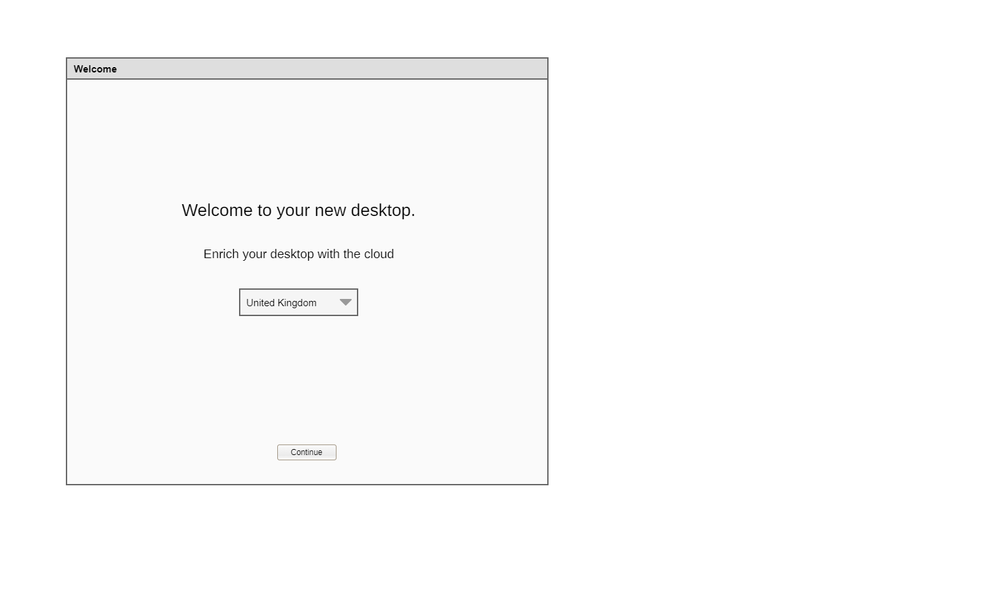
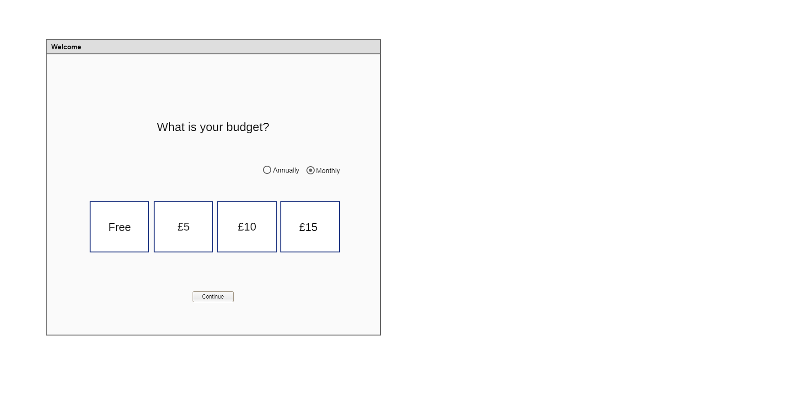
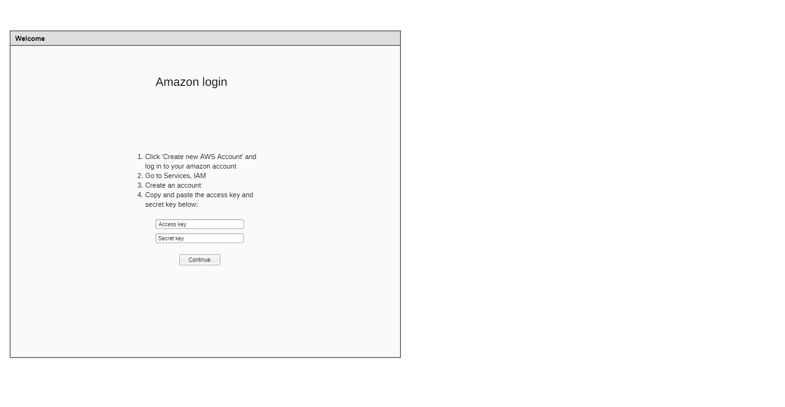
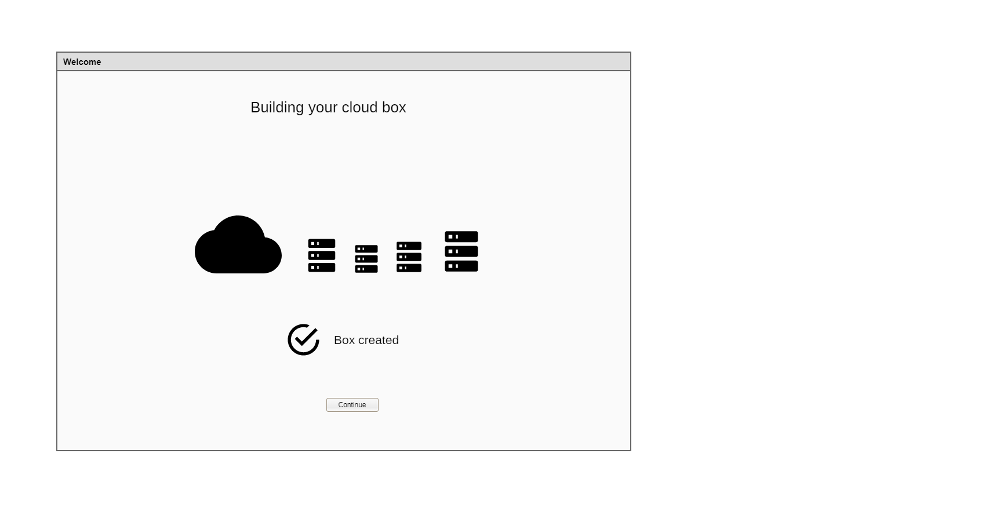
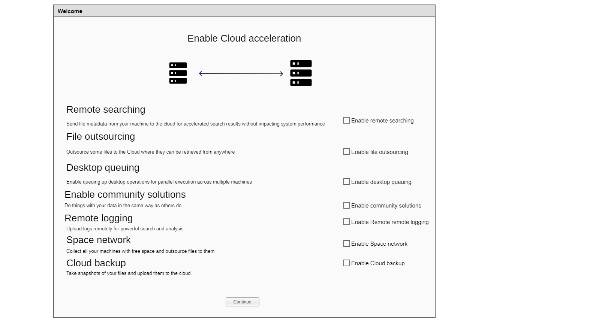
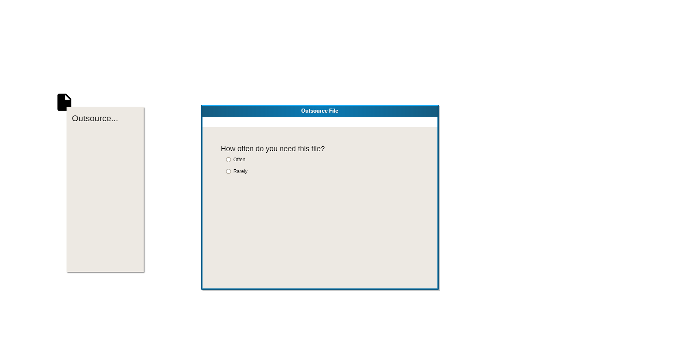
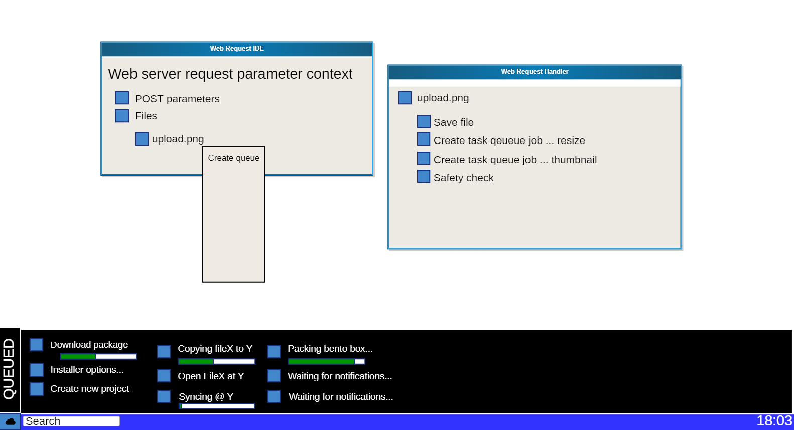
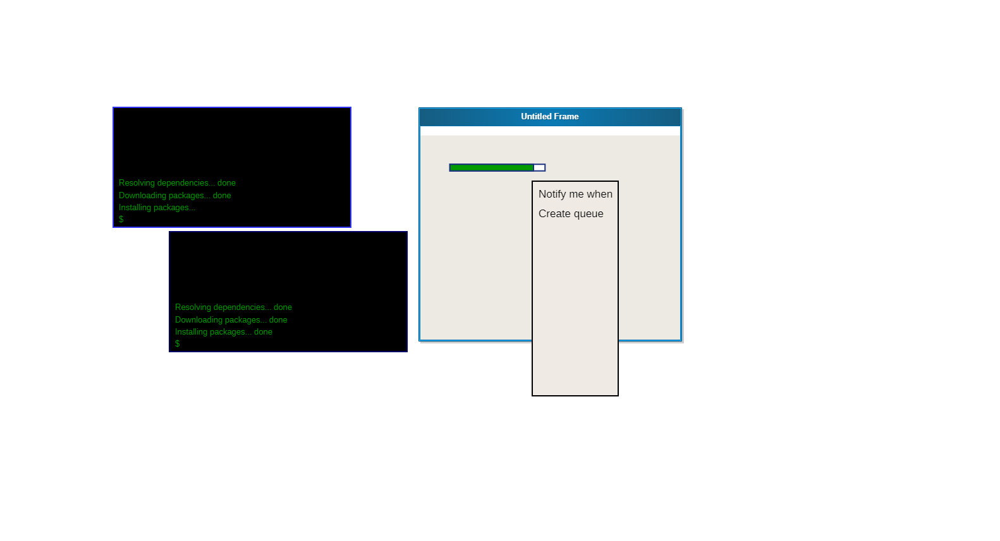
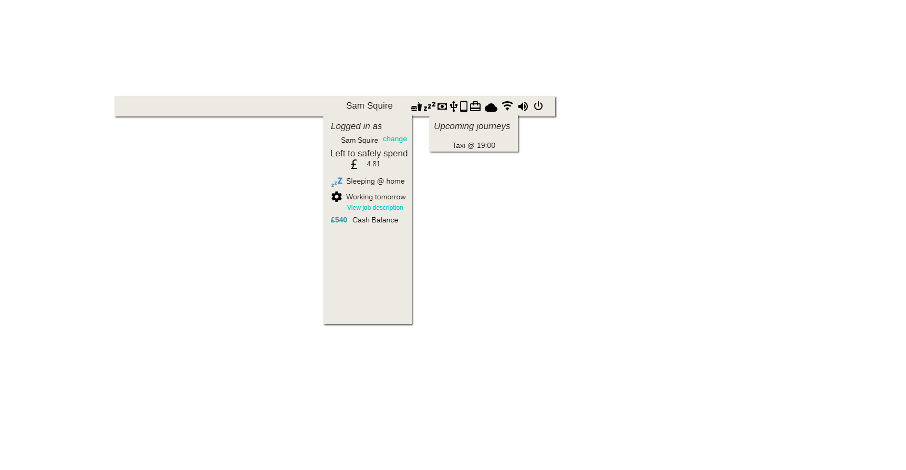
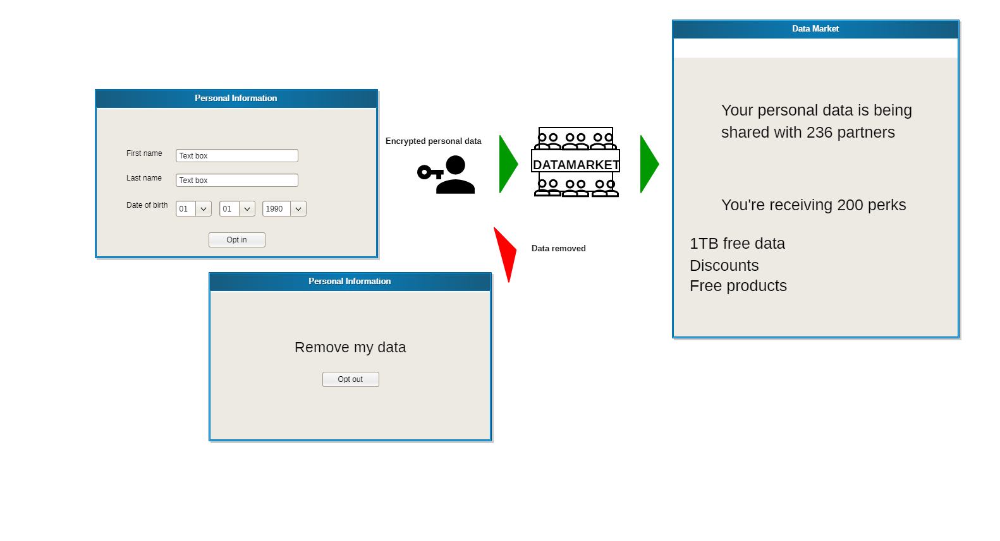

# cloud-desktop

Imagine a desktop that integrated with cloud deeply.

# Welcome

# Pick a digital budget

# Pick a cloud provider

# Log into your cloud provider

# Cloud acceleration

Cloud acceleration is what services can be outsourced to the Cloud from a desktop workstation to improve performance.

**Remote searching** Uploads file lists (locatedb) to the remote machine. Issue searches for local files remotely first.

**File outsourcing** The ability to selectively choose where a file lives. It can be stored remotely and downloaded or streamed when needed.

**Desktop queuing** The ability for a desktop to queue operations across multiple machines

**Enable community solutions** Other people have approaches to various system problems and ways of doing things with their computers. Such as writing their own personal management system, deciding when to delete log files, or some other per user choice about how things should work.

**Remote logging** Send log files to the cloud box for archival and search.

**Space network** Gather all your machines spare space and fill them with files automatically.

**Cloud backup** Create scheduled backups to the cloud

# Outsourcing files

Right clicking a file gives the option to outsource the file to either another machine you own or to the Cloud.

# Desktop queuing

Sometimes we want to achieve multiple things, one after the other. Queuing is way of scheduling operations across UIs and across computers.

How do you queue multiple operations graphically?

 * Right click a call to action and click Create queue

# Desktop wide progress registry

Before a time consuming task is started, it is registered centrally by the desktop environment so progress bars can be collected centrally and queues can be created.

# Declarative GUIs useable before finishing downloading

Imagine if in a package archive there was some GUIs in a standard format early in the archive. It is possible for the desktop environment to present these GUIs to the user to collect data in advance before the remainder has been downloaded.

# Life Indicators

The desktop environment should act as a personal dashboard and include features such as Food, Accommodation, Money, USB devices, Phones, Travel

 * **Ordering food**
 * **Buying transport tickets** If you need to buy transport, you can buy a train ticket or taxi journey
 * **Ordering things locally** Hotel rooms, Coffee shops Protocol for ordering over WiFi. Product broadcast protocol

# Information sharing

